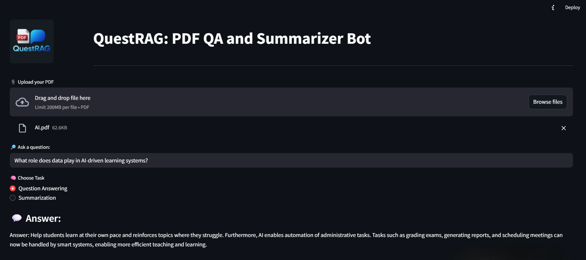

## 🤖 QuestRAG: PDF QA and Summarizer Bot

An AI-powered Streamlit web application that allows you to:
- 📄 Upload research PDFs
- 🔍 Ask context-aware questions from the paper
- 🧠 Get automatic summarization using a local RAG (Retrieval-Augmented Generation) pipeline

This mini project was developed as part of the **"Project Gen AI Applications with RAG and LangChain"** course by IBM on Coursera, with several enhancements for UI, functionality, and offline model usage.

---

## 🚀 Features

- 🧩 **LangChain-powered** RetrievalQA system
- 📚 Upload any research PDF and extract information
- 🤖 Local inference with `Flan-T5-base` and `MiniLM` embeddings
- 💬 Toggle between **Question Answering** and **Summarization**
- 📎 Clean and interactive Streamlit interface with logo branding

---

## 📦 Installation

> Ensure Python 3.9+ is installed.

```bash
git clone https://github.com/YourUsername/QuestRAG.git
cd QuestRAG
pip install -r requirements.txt
streamlit run main.py
````

---

## 🧠 Model Info

| Component      | Model Used                               |
| -------------- | ---------------------------------------- |
| Embeddings     | `sentence-transformers/all-MiniLM-L6-v2` |
| Language Model | `google/flan-t5-base`                    |
| Vector Store   | `ChromaDB` (local)                       |

All models are stored locally for **offline use** in the `saved_model/` directory.

---

## 📝 Sample Questions You Can Ask

* What is the main contribution of the paper?
* How does AI personalize education?
* What role does data play in AI-based learning?
* Which challenges are mentioned in implementing AI in classrooms?

---

## 📸 UI Preview



---

## 🙌 Credits

* 💡 Developed by **Noor Jehan**
* 🎓 Based on the course *"Project Gen AI Applications with RAG and LangChain"* by **IBM** on **Coursera**
